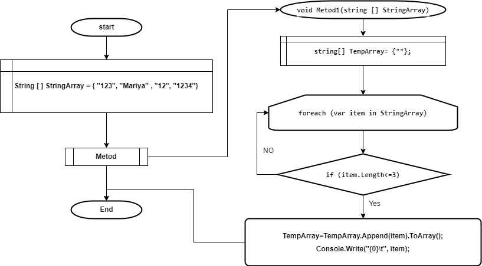
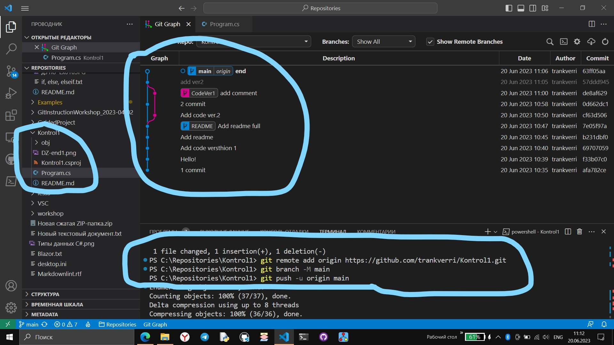

# Контрольная работа
Задача: Написать программу, которая из имеющегося массива строк формирует новый массив из строк, длина которых меньше, либо равна 3 символам.

Блок схема решения

### Описание.

Задется строковый массив данных и передается в метод.
В методе создаем временный массив.
В цикле проверяется каждый Элемент массива данных на соотвктствие
"длина элемента массива меньше или равна трем"ю
Усли условие выполнено элемент массива данных присваивается временному массиву
и выподится в консоль.
Конец программы.

На скрине показано ветвение веток.(не перенесло на гитхаб)
